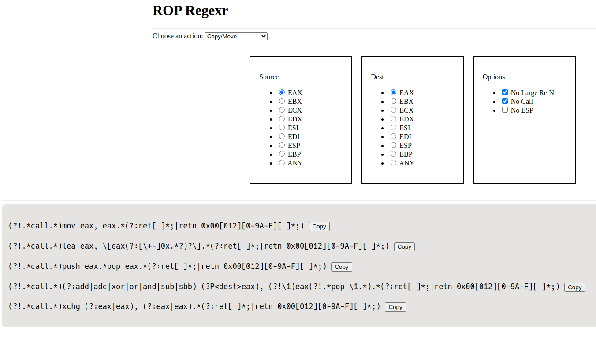

# ROP RegExr

Web application built on Flask that creates regular expressions to use when building a ROP chain

## Getting Started

The repository comes with a `Makefile` with commands for:

* `build`
* `run`
* `run_static`
* `down`

### TLDR

Clone this repo and change into the cloned directory. Run `make build`, then `make run`. Look at the output for the port then visit `http://localhost:<port assigned>`.

### `build`

This is the first command to run. This command will build the docker image by downloading the Python 3.11 base image from Docker Hub, copy the application files to the image, and then install the required python libraries.

### `run`

This will start up the docker container using a random open port. The output will tell you which port the application is running on. Once this command is finished, visit `http://127.0.0.1:<port>`.

### `run_static`

This will start up the docker container using a port defined in the `Makefile`. The default is 5001.

### `down`

This will stop the container. The `run` and `run_static` commands are set to automatically destroy the container when it is stopped.
